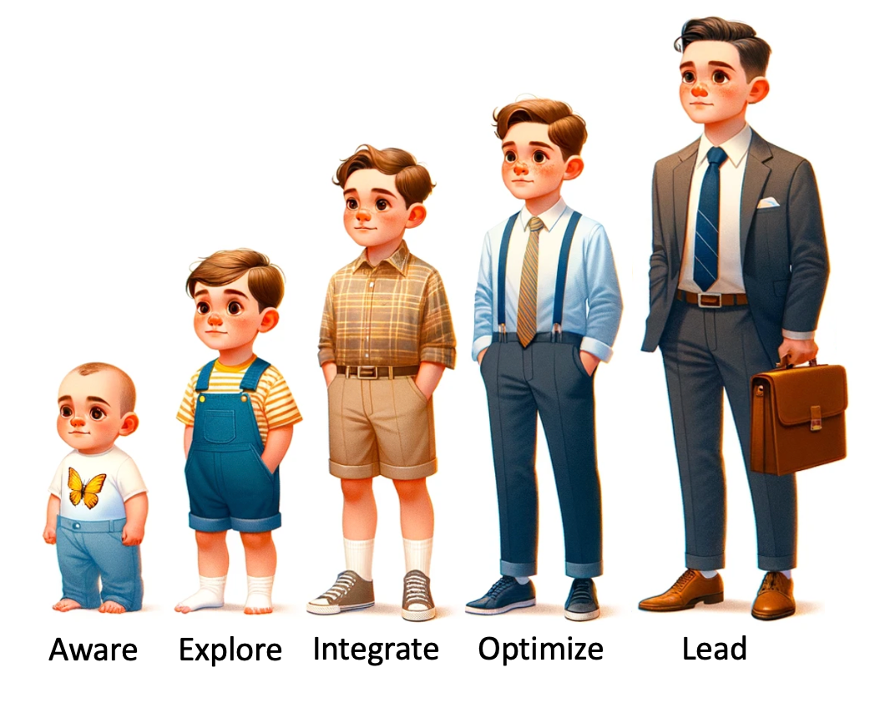

# CMM Generative AL Levels

To help organizations adopt generative AI technologies effectively and mature their capabilities, 
a structured approach aligning with a capability-maturity model can be highly beneficial. 
This model can be envisioned in five layers, each representing a progressive stage in the organization's journey toward advanced generative AI capabilities.  We begin with a classical single-dimensional progression.  We then customize
these layers to include measurable AI stages and describe finer-grain lanes with these levels using the MITRE AI maturity model.

## Layer 1: Awareness and Education

   - **Objective:** Introduce the concept of generative AI, its potential, and its implications.
   - **Actions:** Conduct workshops, seminars, and training sessions. Provide resources for self-learning.
   - **Outcome:** A foundational understanding of generative AI technologies among key stakeholders and decision-makers.

## Layer 2: Exploration and Experimentation Layer

   - **Objective:** Encourage hands-on experimentation with generative AI to understand its capabilities and limitations.
   - **Actions:** Set up pilot projects or proof-of-concept initiatives. Provide guidance on selecting suitable use cases and tools. Offer technical support and mentorship.
   - **Outcome:** Initial practical experience with generative AI, leading to insights on its applicability and impact.

## Layer 3: Integration and Application

   - **Objective:** Integrate generative AI into business processes and workflows.
   - **Actions:** Develop strategies for integration, focusing on areas with the highest potential impact. Facilitate the adoption of best practices in AI ethics and data management. Ensure robust IT infrastructure support.  Develop an integrated knowledge graph.
   - **Outcome:** Generative AI becomes part of the operational workflow, contributing to efficiency and innovation.

## Layer 4: Optimization and Enhancement

   - **Objective:** Refine and enhance the use of generative AI to maximize its benefits.
   - **Actions:** Analyze performance data to identify improvement areas. Implement advanced techniques and algorithms. Foster a culture of continuous learning and adaptation.
   - **Outcome:** Improved efficiency and effectiveness of generative AI applications, leading to tangible business benefits.

## Layer 5: Leadership and Transformation

   - **Objective:** Establish the organization as a leader in the field of generative AI.
   - **Actions:** Innovate new applications and uses of generative AI. Share knowledge and best practices within the industry. Develop a roadmap for future AI initiatives.
   - **Outcome:** The organization not only leverages generative AI for its own benefits but also influences the broader industry landscape.

Throughout these layers, it’s crucial to maintain a focus on ethical considerations, regulatory compliance, and the responsible use of AI. This includes addressing biases in AI models, ensuring data privacy, and considering the societal impacts of AI applications. Regular assessments and revisions of the strategy should be undertaken to align with evolving AI technologies and market dynamics.
